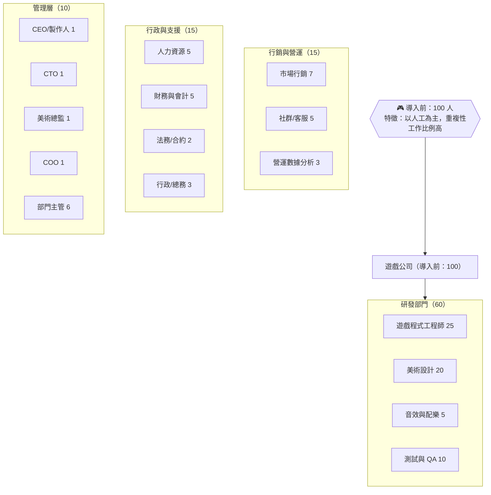

```mermaid
%% 導入前：100 人
flowchart TB
    info{{"🎮 導入前：100 人<br>特徵：以人工為主，重複性工作比例高"}}

    A[遊戲公司（導入前：100）]

    subgraph RnD[研發部門（60）]
        R1[遊戲程式工程師 25]
        R2[美術設計 20]
        R3[音效與配樂 5]
        R4[測試與 QA 10]
    end

    subgraph MKTOPS[行銷與營運（15）]
        M1[市場行銷 7]
        M2[社群/客服 5]
        M3[營運數據分析 3]
    end

    subgraph GNA[行政與支援（15）]
        H1[人力資源 5]
        F1[財務與會計 5]
        L1[法務/合約 2]
        A1[行政/總務 3]
    end

    subgraph MGMT[管理層（10）]
        C1[CEO/製作人 1]
        C2[CTO 1]
        C3[美術總監 1]
        C4[COO 1]
        C5[部門主管 6]
    end

    info --> A
    A --> RnD

```
    A --> MKTOPS
    A --> GNA
    A --> MGMT
