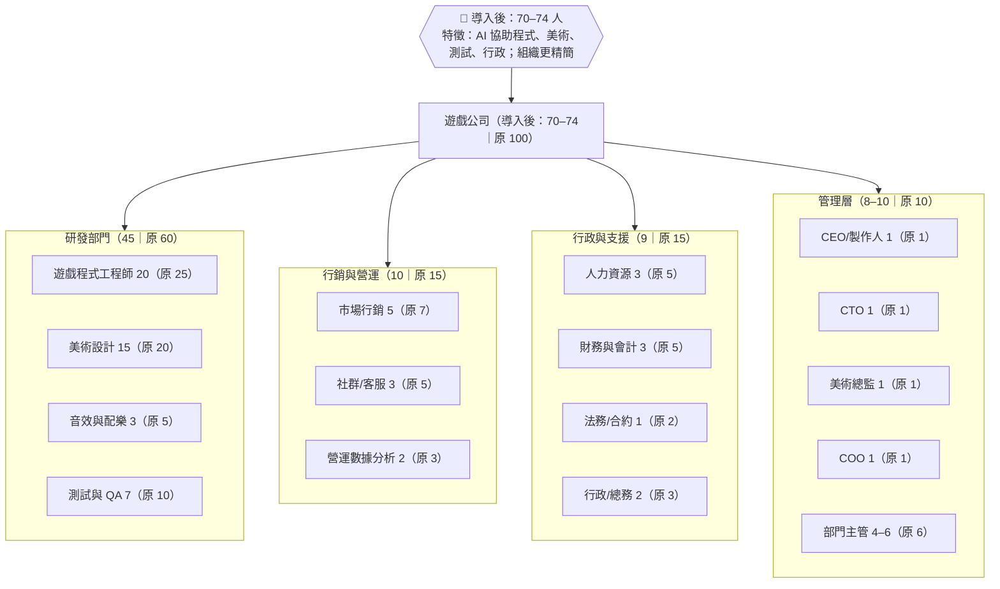

```mermaid
%% 導入後：70–74 人（括號為原始人數）
flowchart TB
    info{{"🤖 導入後：70–74 人<br>特徵：AI 協助程式、美術、測試、行政；組織更精簡"}}

    A[遊戲公司（導入後：70–74｜原 100）]

    subgraph RnD[研發部門（45｜原 60）]
        R1[遊戲程式工程師 20（原 25）]
        R2[美術設計 15（原 20）]
        R3[音效與配樂 3（原 5）]
        R4[測試與 QA 7（原 10）]
    end

    subgraph MKTOPS[行銷與營運（10｜原 15）]
        M1[市場行銷 5（原 7）]
        M2[社群/客服 3（原 5）]
        M3[營運數據分析 2（原 3）]
    end

    subgraph GNA[行政與支援（9｜原 15）]
        H1[人力資源 3（原 5）]
        F1[財務與會計 3（原 5）]
        L1[法務/合約 1（原 2）]
        A1[行政/總務 2（原 3）]
    end

    subgraph MGMT[管理層（8–10｜原 10）]
        C1[CEO/製作人 1（原 1）]
        C2[CTO 1（原 1）]
        C3[美術總監 1（原 1）]
        C4[COO 1（原 1）]
        C5[部門主管 4–6（原 6）]
    end

    info --> A
    A --> RnD
    A --> MKTOPS
    A --> GNA
    A --> MGMT
```
